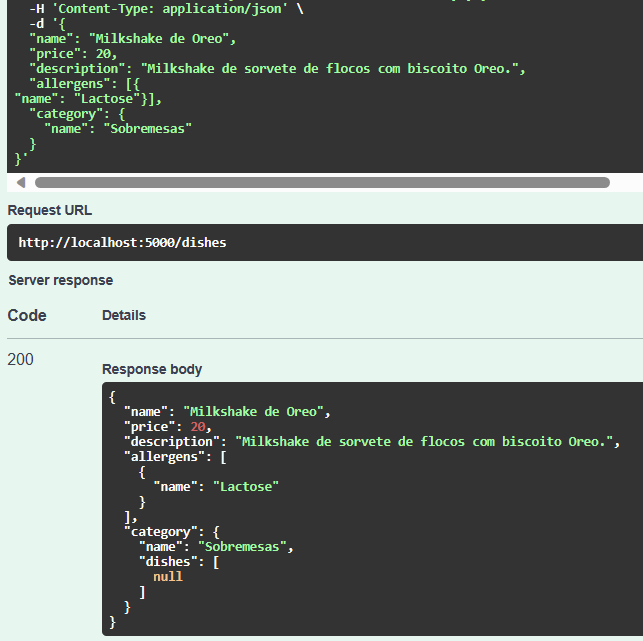

# Free_API
A restaurant menu API with allergens.

## Updated 02/02/2025

The current version has Docker Compose responsible for running the API and PostgreSQL database. Also, the project was deployed on an AWS' EC2 instance. Check the video below.
https://youtu.be/lcjN7iC5g0c

## Description
This is a restaurant menu API. It's possible to add, edit and delete a dish, see and edit other informations, but only if logged in. To do so, it's necessary to sign up.

## Built with
* C#
* .Net 6
* Swagger
* SQL database

## Screenshots

## Contact me
LinkedIn: https://www.linkedin.com/in/larissalimaqueiroz/